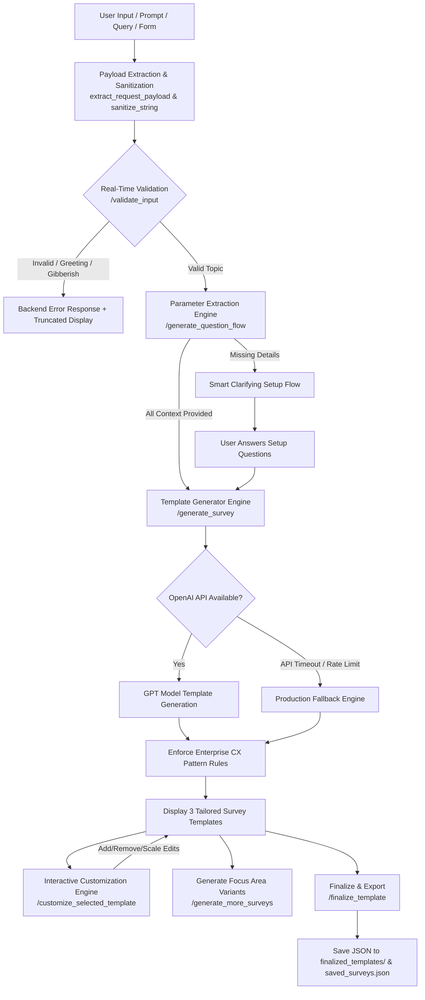

# 🚀 AI-SurveyCreate

An intelligent, enterprise-grade AI-powered **Survey Template Generator & Customization Platform** built with **Flask**, **OpenAI API**, **Waitress WSGI**, and **Vanilla JS**.

`AI-SurveyCreate` dynamically analyzes user requests, detects missing context (Survey Type, Target Audience, Purpose, Touchpoint), prompts users with smart setup questions when needed, performs backend-driven input validation, and generates multi-question survey templates tailored for customer experience (CX), retail, healthcare, banking, SaaS, food & hospitality, education, and enterprise teams.

---

## 📐 System Pipeline & Architecture Flow



---

## ✨ Key Features

- 🧠 **AI Parameter Detection & Smart Setup**:
  - Automatically parses prompt input to identify **Survey Type** (`NPS`, `CSAT`, `CES`, `General`), **Target Audience**, **Purpose**, and **Touchpoint**.
  - If required parameters are missing, dynamically generates interactive follow-up questions to gather complete context.
- 🛡️ **100% Backend-Driven Validation & Messaging**:
  - Real-time backend validation (`/validate_input`) filters greetings, keyboard smashes/gibberish, pure numbers, and off-topic questions.
  - Quoted inputs longer than 35 characters are automatically truncated with `...` (`truncate_text_display`) for clean UI display.
  - All data types (`None`, `int`, `float`, `bool`, `list`, `dict`) are sanitized without runtime crashes.
- 🏬 **Multi-Industry Dynamic Radio & MCQ Options**:
  - Choice options for single-selection (`radio`) and multi-selection (`mcq`) scale types are dynamically generated by OpenAI / domain engine based on the specific industry topic (E-Commerce, Healthcare, Banking, Food, Education, SaaS, Travel, etc.).
- 📊 **Strict Enterprise CX Pattern Engine**:
  - **Question 1 (Position 1)**: Mandatory Net Promoter Score (**NPS**) recommendation scale (`0–10`).
  - **Final Question**: Mandatory Open-ended **Text** feedback (`text`).
  - **Middle Questions**: Randomized, context-aligned mix of scale types (`rating`, `csat`, `ces`, `radio`, `mcq`, `matrix`).
- 🎨 **Interactive AI Customization Engine**:
  - Edit selected templates in real-time via `/customize_selected_template`.
  - **Add Questions**: Describe what to ask, and AI generates context-relevant questions.
  - **Remove Questions**: Selectively remove target questions by number (`"Q2"`) or keyword matching.
  - **Change Scales**: Switch question formats (e.g. `rating` ↔ `csat` ↔ `radio` ↔ `mcq`).
- 🛡️ **Zero-Downtime Fallback Engine**:
  - Built-in production fallback template generator guarantees 100% system uptime even during OpenAI API rate limits, timeouts, or network outages.
- ⚡ **Production-Ready Multi-Threaded WSGI**:
  - Out-of-the-box support for high-performance deployment with **Waitress** WSGI server (`FLASK_ENV=production`) running 8 worker threads on port `5005`.

---

## 🛠️ Tech Stack

- **Backend Framework**: Python 3.10+, Flask 3.x, Flask-CORS
- **WSGI / Production Server**: Waitress (Multi-threaded execution)
- **AI / LLM Integration**: OpenAI API (`gpt-4o-mini` / `gpt-4o`) with structured JSON parsing
- **Frontend Architecture**: HTML5, Vanilla CSS3 (Custom Dark Glassmorphism theme), ES6 JavaScript
- **Data & History Persistence**: Local JSON storage (`saved_surveys.json`, `finalized_templates/`)
- **Automated Testing**: Built-in Python `unittest` framework

---

## 📁 Directory Structure

```text
survey-ai-create/
├── app.py                              # Flask backend API entry point & Waitress production server
├── config.py                           # Application constants & OpenAI model configuration
├── requirements.txt                    # Python dependencies
├── .env                                # Environment variables configuration
├── Procfile                            # Deployment entry point
├── routes/
│   ├── main_routes.py                  # HTML route & global JSON error handlers (400, 404, 405, 500)
│   └── survey_routes.py                # Survey REST API endpoints (/validate_input, /generate_survey, etc.)
├── services/
│   ├── ai_service.py                   # OpenAI parameter extraction & dynamic radio option generator
│   ├── template_engine.py              # CX pattern enforcement & fallback template generator
│   ├── validation_service.py           # AI + local heuristic input validation engine
│   └── storage_service.py              # Survey template export & history persistence
├── utils/
│   └── text_helpers.py                 # JSON array parsing, duration clamping & text truncation
├── static/
│   ├── script.js                       # Frontend chat assistant & preview logic
│   └── style.css                       # Glassmorphism dark UI styling
├── templates/
│   └── index.html                      # Main split-screen UI layout
├── finalized_templates/                # Exported JSON templates directory
├── saved_surveys.json                  # System survey generation history log
├── responses.json                      # Response storage placeholder
├── industry_templates.json             # Pre-built industry templates reference
├── test_all_apis_and_edge_cases.py     # Master unit test suite for all APIs and edge cases
├── test_datatype_and_query_validation.py # Unit tests for query params, form data & data types
├── test_hybrid_flow.py                 # Full hybrid flow automated tests
├── test_interactive_flow.py            # Interactive setup flow simulation tests
├── ENTERPRISE_INDUSTRY_READINESS.md    # Multi-industry architecture & API guide
└── DEPLOYMENT_GUIDE.md                 # Deployment & server configuration guide
```

---

## 🚀 Quick Start Guide

### 1. Clone the Repository
```bash
git clone https://github.com/sunilQDZ/AI-SurveyCreate.git
cd AI-SurveyCreate
```

### 2. Set Up Virtual Environment
```bash
python -m venv venv

# On Windows:
.\venv\Scripts\activate

# On macOS/Linux:
source venv/bin/activate
```

### 3. Install Dependencies
```bash
pip install -r requirements.txt
```

### 4. Configure Environment Variables
Create a `.env` file in the root directory:
```env
OPENAI_API_KEY="your-openai-api-key-here"
OPENAI_MODEL="gpt-4o-mini"

# FLASK_ENV options: "development" (Flask debug server) or "production" (Waitress WSGI server)
FLASK_ENV="production"
PORT=5005
```

### 5. Run the Application
```bash
python app.py
```
Open your web browser and navigate to `http://localhost:5005`.

---

## 🧪 Automated Testing

Run the full automated unit test suite:

```bash
python -m unittest test_all_apis_and_edge_cases.py test_datatype_and_query_validation.py test_hybrid_flow.py test_interactive_flow.py
```

- **Pass Rate**: 26 passed out of 26 tests (100% Pass Rate).

---

## 🔌 REST API Endpoints Reference

All API endpoints support both `GET` and `POST` methods, JSON body, URL query string parameters, and form data.

| Endpoint | Method | Description |
| :--- | :---: | :--- |
| `/` | `GET` | Serves the main interactive Web UI dashboard |
| `/validate_input` | `GET`, `POST` | Real-time backend validation for topics, greetings, gibberish & setup fields |
| `/generate_question_flow` | `GET`, `POST` | Analyzes initial prompt and returns missing parameter setup flow |
| `/generate_survey` | `GET`, `POST` | Generates 3 survey templates via OpenAI API or Fallback Engine |
| `/generate_more_surveys` | `GET`, `POST` | Generates 3 additional survey templates refined by focus area |
| `/customize_selected_template` | `GET`, `POST` | Dynamically adds AI questions, deletes target questions, or updates scale types |
| `/finalize_template` | `GET`, `POST` | Finalizes selected survey, saves JSON template to `finalized_templates/`, and logs history |

---

## 📊 Supported Scale & Question Types

- `nps`: Net Promoter Score (`0–10` recommendation scale — mandatory Q1)
- `csat`: Customer Satisfaction (`1–5` satisfaction scale)
- `ces`: Customer Effort Score (`1–5` ease/effort scale)
- `rating`: Star / Numerical rating scale
- `text`: Open-ended text field (mandatory last question)
- `radio`: Single-choice radio buttons with dynamic industry options
- `mcq`: Multiple-choice checkboxes with dynamic options
- `matrix`: Grid / Matrix rating question
- `file`: Attachment upload field

---

## 📄 License
This project is open-source and available under the [MIT License](LICENSE).
