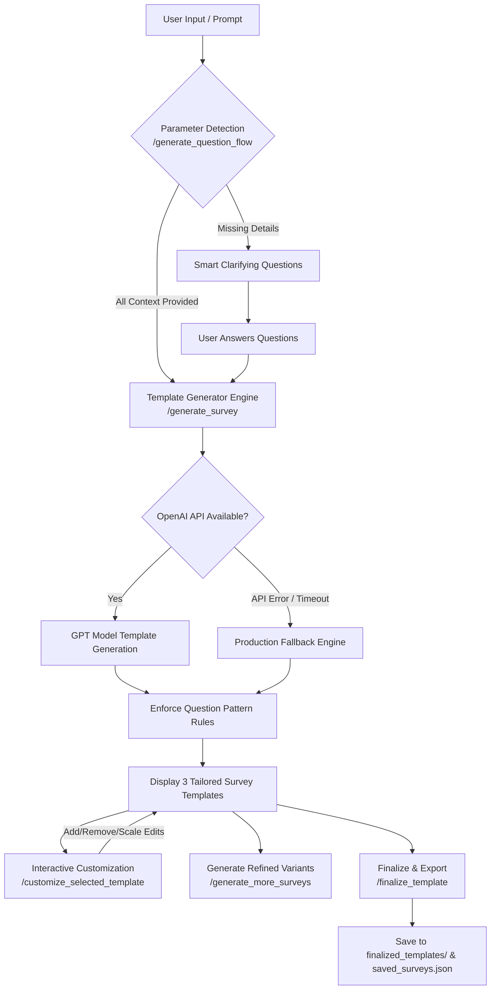

# 🚀 AI-SurveyCreate

An intelligent, AI-powered **Survey Template Generator & Customization Platform** built with **Flask**, **OpenAI API**, **Waitress**, and **Vanilla JS**.

`AI-SurveyCreate` dynamically analyzes user requests, detects missing context (Survey Type, Target Audience, Purpose, Touchpoint), prompts users with smart clarifying questions when needed, and generates multi-question survey templates tailored for customer experience (CX), product feedback, education, healthcare, and enterprise teams.

---

## 📐 System Pipeline & Architecture Flow



---

## ✨ Key Features

- 🧠 **AI Parameter Detection & Smart Setup**:
  - Automatically parses prompt input to identify **Survey Type** (`NPS`, `CSAT`, `CES`, `General`), **Target Audience**, **Purpose**, and **Touchpoint**.
  - If required parameters are missing, dynamically generates interactive follow-up questions to gather complete context.
- 📊 **Strict Multi-Question Pattern Engine**:
  - **Question 1 (Position 1)**: Always mandatory **NPS** recommendation scale (`0–10`).
  - **Final Question**: Always mandatory **Open-ended Text** feedback (`text`).
  - **Middle Questions**: Randomized, context-aligned mix of scale types (`rating`, `csat`, `ces`, `radio`, `mcq`, `matrix`).
- 🎨 **Interactive AI Customization Engine**:
  - Edit selected templates in real-time.
  - **Add Questions**: Describe what to ask, and AI generates context-relevant questions matching target scale types.
  - **Remove Questions**: Selectively remove target questions.
  - **Change Scales**: Dynamically switch question formats (e.g. `rating` ↔ `csat` ↔ `radio` ↔ `mcq`).
  - **Guardrails**: Integrated off-topic detection prevents irrelevant inputs.
- 🛡️ **Production Fallback Engine**:
  - Built-in fallback template generator guarantees 100% system uptime even during OpenAI API rate limits, timeouts, or network outages.
- ⚡ **Production-Ready Multi-Threaded WSGI**:
  - Out-of-the-box support for high-performance deployment with **Waitress** WSGI server (`FLASK_ENV=production`).

---

## 🛠️ Tech Stack

- **Backend Framework**: Python 3.10+, Flask 3.x, Flask-CORS
- **WSGI / Production Server**: Waitress (Multi-threaded execution)
- **AI / LLM Integration**: OpenAI API (`gpt-4o-mini` / `gpt-3.5-turbo`) with structured JSON parsing
- **Frontend Architecture**: HTML5, Vanilla CSS3 (Custom Dark Glassmorphism theme), ES6 JavaScript
- **Data & History Persistence**: Local JSON storage (`saved_surveys.json`, `finalized_templates/`)

---

## 📁 Directory Structure

```text
survey-ai-create/
├── app.py                      # Flask backend API & AI pipeline handlers
├── requirements.txt            # Python dependencies
├── .env                        # Environment variables configuration
├── Procfile                    # Deployment entry point
├── static/
│   ├── script.js               # Frontend chat assistant & preview logic
│   └── style.css               # Glassmorphism dark UI styling
├── templates/
│   └── index.html              # Main split-screen UI layout
├── finalized_templates/        # Exported JSON templates directory
├── saved_surveys.json          # System survey generation history log
├── responses.json              # Response storage placeholder
└── industry_templates.json     # Pre-built industry templates reference
```

---

## 🚀 Quick Start Guide

### 1. Clone the Repository
```bash
git clone https://github.com/sunilQDZ/AI-SurveyCreate.git
cd AI-SurveyCreate
```

### 2. Set Up Virtual Environment
```bash
python -m venv venv

# On Windows:
.\venv\Scripts\activate

# On macOS/Linux:
source venv/bin/activate
```

### 3. Install Dependencies
```bash
pip install -r requirements.txt
```

### 4. Configure Environment Variables
Create a `.env` file in the root directory:
```env
OPENAI_API_KEY="your-openai-api-key-here"
OPENAI_MODEL="gpt-4o-mini"

# FLASK_ENV options: "development" (Flask debug server) or "production" (Waitress WSGI server)
FLASK_ENV="production"
PORT=5005
```

### 5. Run the Application
```bash
python app.py
```
Open your web browser and navigate to `http://localhost:5005` (or `http://localhost:5000` depending on your configured `PORT`).

---

## 🔌 API Endpoints Reference

| Endpoint | Method | Description |
| :--- | :---: | :--- |
| `/` | `GET` | Serves the main interactive Web UI dashboard |
| `/generate_question_flow` | `POST` | Analyzes initial user prompt and returns missing parameter clarifying flow |
| `/generate_survey` | `POST` | Generates 3 initial survey templates via OpenAI API or Production Fallback Engine |
| `/generate_more_surveys` | `POST` | Generates 3 additional survey templates refined by focus area |
| `/customize_selected_template` | `POST` | Dynamically adds AI questions, deletes target questions, or updates scale types |
| `/finalize_template` | `POST` | Finalizes selected survey, saves JSON template to `finalized_templates/`, and logs history |

---

## 📊 Supported Scale & Question Types

- `nps`: Net Promoter Score (`0–10` recommendation scale)
- `csat`: Customer Satisfaction (`1–5` satisfaction scale)
- `ces`: Customer Effort Score (`1–5` ease/effort scale)
- `rating`: Star / Numerical rating scale
- `text`: Open-ended text field
- `radio`: Single-choice radio buttons
- `mcq`: Multiple-choice checkboxes
- `matrix`: Grid / Matrix rating question
- `file`: Attachment upload field

---

## 📄 License
This project is open-source and available under the [MIT License](LICENSE).
